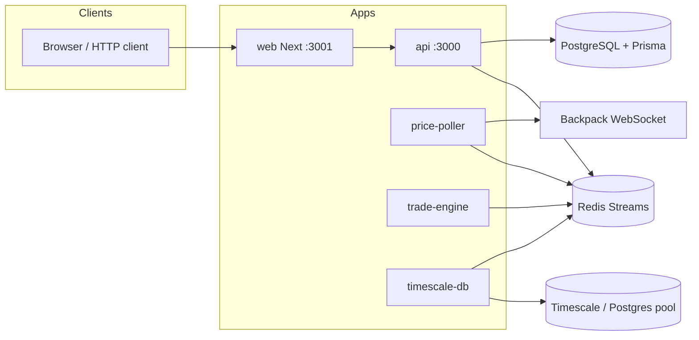

# exness-clone-mono — project reference

This document describes the **current** layout, responsibilities, and how the pieces fit together. Use it for onboarding and planning work across the monorepo.

## Purpose

A **Turborepo + Bun** monorepo modeling a broker-style stack: HTTP API for auth and trade requests, a **Redis Streams** bus, a **trade engine** worker, a **price poller** feeding live quotes, a **TimescaleDB** consumer for ticks and (intended) candle aggregates, and a **Next.js** trading UI in `apps/web` (port `3001`) that calls the API with credentials. Shared contracts live in `@repo/types`; Redis access is centralized in `@repo/redis`.

The root `README.md` is still the generic Turborepo starter text; this file reflects the **actual** apps and packages in the tree.

## Tooling

| Item                   | Value                                                       |
| ---------------------- | ----------------------------------------------------------- |
| Package manager        | **Bun** `1.3.5` (`packageManager` in root `package.json`)   |
| Monorepo orchestration | **Turborepo** (`turbo.json`)                                |
| Workspaces             | `apps/*`, `packages/*`                                      |
| TypeScript             | `5.9.2` at root; apps use `peerDependencies: typescript ^5` |
| Node engines           | `>=18` (root)                                               |

Root scripts:

- `bun run build` — `turbo run build`
- `bun run dev` — `turbo run dev` (persistent, no cache)
- `bun run lint` — `turbo run lint`
- `bun run check-types` — `turbo run check-types`
- `bun run format` — Prettier on `*.{ts,tsx,md}`

Per-app `.cursor/rules` recommend Bun over Node/npm/pnpm for `api`, `trade-engine`, `price-poller`, `timescale-db`, and shared packages.

## High-level architecture



- **`send_stream`**: price ticks and trade jobs from API and price-poller; consumed by trade-engine and timescale-db.
- **`response_stream`**: order responses from trade-engine; consumed by API worker to resolve pending HTTP requests.

Queue names are defined as `QUEUES.SEND_STREAM` / `QUEUES.RESPONSE_STREAM` in `@repo/types` (`send_stream`, `response_stream`).

## Repository tree (logical)

```
exness-clone-mono/
├── package.json              # workspaces, turbo scripts, bun pin
├── turbo.json
├── bun.lock
├── README.md                 # generic Turborepo template (not app-specific)
├── PROJECT_INFO.md           # this file
├── apps/
│   ├── api/                  # Express HTTP API, Prisma, Redis publisher + response consumer
│   ├── web/                  # Next.js 15 terminal UI → API (see below)
│   ├── trade-engine/         # Redis consumer: prices + orders, in-memory trading
│   ├── price-poller/         # WebSocket → Redis price ticks
│   └── timescale-db/         # Redis consumer → Postgres/Timescale inserts + MVs
└── packages/
    ├── types/                # @repo/types — Zod schemas, enums, queue names
    ├── redis/                # @repo/redis — shared publisher/subscriber clients
    ├── ui/                   # @repo/ui — React 19 stub components (button, card, code)
    ├── eslint-config/        # @repo/eslint-config
    └── typescript-config/    # @repo/typescript-config — shared tsconfigs
```

Generated / vendor-style paths under `apps/api/generated/prisma/` come from Prisma client output (`schema.prisma` `output = "../generated/prisma"`).

## Apps

### `apps/api` (package name: `api`)

- **Runtime**: Bun; entry `src/index.ts`.
- **Framework**: Express 5, CORS, JSON body.
- **Port**: `3000`.
- **Prefix**: `/api/v1` → `src/routes/index.ts`.
- **Routes**:
  - `/auth` — magic-link style login/signup (`authRouter.ts`), Prisma `User` / `MagicToken`, JWT cookie `sessionToken`, Redis `ADD_USER` on successful login callback.
  - `/trade` — behind `authMiddleware`; trade operations enqueue jobs to Redis and await responses via in-memory `pending` map + `listenForResponse` in `src/validators/worker.ts`.
- **Database**: Prisma 7 + `@prisma/adapter-pg`, schema `User`, `MagicToken`; config `prisma.config.ts` + `DATABASE_URL`; migrations under `prisma/migrations/`.
- **Dependencies**: `@repo/redis`, `@repo/types`, `zod`, `jsonwebtoken`, etc.

### `apps/web` (package name: `web`)

- **Stack**: Next.js 15 (App Router), React 19, Tailwind CSS 4, `@repo/types` for `AssetSymbols`.
- **Port**: `3001` (`next dev` / `next start` scripts).
- **UI**: Exness-style landing (`/`), magic-link login (`/login`), token callback (`/auth/callback?token=`), WebTrader-style layout at `/webtrading` (TradingView Lightweight Charts; order UI is presentational until wired to the API).
- **API usage**: `NEXT_PUBLIC_API_BASE_URL` (default `http://localhost:3000`); `fetch` with `credentials: "include"` for `sessionToken`. Middleware redirects unauthenticated users away from `/webtrading`.
- **Note**: Does not import `@repo/ui` yet; shared UI package remains optional for later.

### `apps/trade-engine`

- **Entry**: `src/index.ts` — loop: `XREAD` on `QUEUES.SEND_STREAM`, parse with `EventSchema` from `@repo/types`.
- **Behavior**: Updates in-memory prices on `PRICE_TICK`; handles `CREATE_ORDER`, `CLOSE_ORDER`, `GET_OPEN_TRADES`, `ADD_USER` via `handlers.ts` / `inMemoryDb.ts`; replies on `QUEUES.RESPONSE_STREAM` with `ORDER_RESPONSE` payloads.
- **Dependencies**: `@repo/redis`, `@repo/types`, `zod`.

### `apps/price-poller`

- **Entry**: `src/index.ts` — WebSocket client to `wss://ws.backpack.exchange/` (`constants.ts`), subscribes to `bookTicker.BTCUSDT` / `bookTicker.ETHUSDT`.
- **Behavior**: Maintains `inMemoryStore`; every 5s publishes `PRICE_TICK` JSON to `QUEUES.SEND_STREAM`.
- **Dependencies**: `ws`, `@repo/redis`, `@repo/types`.

### `apps/timescale-db`

- **Entry**: `src/index.ts` — `XREAD` on `send_stream` (from `$`), validates `EventSchema`, on `PRICE_TICK` calls `insertTick` per ticker.
- **Database**: `pg` `Pool` in `src/db.ts` (connection string currently hardcoded to local `exnessclone`).
- **Setup**: `dbUtils.ts` — `initDB`, continuous aggregate helpers for 1m / 5m candles (TimescaleDB-specific SQL); requires a Timescale-enabled Postgres matching the SQL.

## Packages

### `@repo/types` (`packages/types`)

- **Exports**: `src/index.ts` — `AssetSymbols`, `EVENT_KINDS`, `JOB_KINDS`, `QUEUES`, Zod discriminated `EventSchema`, job/response schemas, and small TS interfaces (`BookTicker`, `AssetMidPrice`, etc.).
- **Dependency**: `zod`.

### `@repo/redis` (`packages/redis`)

- **Exports**: `src/index.ts` — Node `redis` client `publisher` and `subscriber`, singleton pattern on `globalThis`, both `connect()` on load.

### `@repo/ui` (`packages/ui`)

- **Exports**: `./src/*.tsx` — `button`, `card`, `code` stubs.
- **Scripts**: `lint`, `check-types`, `generate:component` (turbo gen).
- Shared React library scaffold; `apps/web` does not consume it yet (local Tailwind components instead).

### `@repo/eslint-config` / `@repo/typescript-config`

- Shared ESLint flat configs and `tsconfig` fragments (`base.json`, `nextjs.json`, `react-library.json`) for packages like `ui`.

## Shared event model (summary)

| `kind` / enum                                                | Producer                          | Main consumers                 |
| ------------------------------------------------------------ | --------------------------------- | ------------------------------ |
| `PRICE_TICK`                                                 | `price-poller`, (could be others) | `trade-engine`, `timescale-db` |
| `CREATE_ORDER`, `CLOSE_ORDER`, `GET_OPEN_TRADES`, `ADD_USER` | `api`                             | `trade-engine`                 |
| `ORDER_RESPONSE`                                             | `trade-engine`                    | `api` (`validators/worker.ts`) |

## Local development checklist

1. **Redis** — running and reachable by default client URL (see `redis` package / env if you add one).
2. **Postgres** — for API: `DATABASE_URL` for Prisma migrate and runtime (`prisma.ts`).
3. **Timescale** — for `timescale-db`: pool URL in `apps/timescale-db/src/db.ts` (or refactor to env).
4. **Processes** — typically run in separate terminals (or filtered turbo):
   - `api` — `bun run dev` in `apps/api`
   - `web` — `bun run dev` in `apps/web`
   - `trade-engine` — `bun run dev` in `apps/trade-engine`
   - `price-poller` — `bun run dev` in `apps/price-poller`
   - `timescale-db` — `bun run dev` in `apps/timescale-db`

Prisma commands are documented in `prisma.config.ts` as using `bun --bun run prisma [command]` from the API app directory.

## Documentation fragments in-repo

Several apps and packages include **`CLAUDE.md`** files with project-local guidance for AI assistants. App-level `README.md` files are mostly Bun init boilerplate.

## Notes for maintainers

- **Cookie auth**: `authMiddleware` reads `sessionToken` cookie; JWT secret is currently a literal in code paths — move to `process.env` for any shared or production setup.
- **Trade routes**: Some paths and emails are still placeholders or duplicated (`tradeRouter` mixes mount paths and hardcoded email in places); align with authenticated `req.userId` / body when hardening.
- **timescale-db `dbUtils`**: hypertable / continuous aggregate SQL is Timescale-specific; verify column names (`asset` vs `ticker`) and extension compatibility with your DB before relying on inserts and MVs.
- **Root README**: Still describes a generic `docs` / `web` Turborepo example; update when you want the public face of the repo to match this project.

---

_Last reviewed against the repository layout as of the session that added this file (May 2026)._
