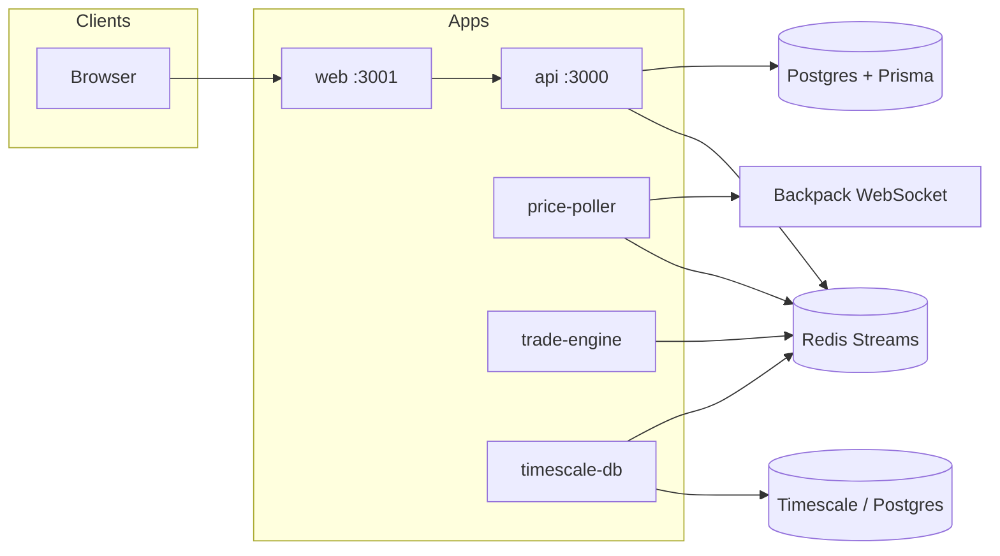

# exness-clone-mono

A **Bun + Turborepo** monorepo modeling a broker-style stack: **Next.js trading UI → HTTP API → Redis Streams → workers** (trade engine, price poller, Timescale consumer).

## TL;DR (≤ 60 seconds)

- **UI**: `apps/web` (Next.js) on `http://localhost:3001`
- **API**: `apps/api` on `http://localhost:3000/api/v1` (magic-link auth + trade requests)
- **Event bus**: **Redis Streams** (`send_stream`, `response_stream`) connects API ↔ workers
- **Workers**: `price-poller` publishes ticks, `trade-engine` executes jobs, `timescale-db` persists ticks
- **Demo**: log in, open `/webtrading`, and place trades (end-to-end path is wired through streams)

## Screenshots (add yours)

> Replace these with real screenshots: `docs/images/webtrading.png` and `docs/images/login.png`


## Table of contents

- [What’s inside](#whats-inside)
- [Architecture](#architecture)
- [Key flows](#key-flows)
- [Quickstart (end-to-end)](#quickstart-end-to-end)
- [Configuration](#configuration)
- [Troubleshooting](#troubleshooting)
- [Design decisions & trade-offs](#design-decisions--trade-offs)
- [Limitations / project status](#limitations--project-status)
- [Next steps](#next-steps)

## What’s inside

### Apps (`apps/*`)

- `apps/web`: Next.js trading UI (port **3001**)
- `apps/api`: Express API (port **3000**) + Prisma/Postgres + Redis publisher/consumer
- `apps/trade-engine`: Redis consumer that processes trade jobs + maintains in-memory trading state
- `apps/price-poller`: WebSocket market feed → publishes `PRICE_TICK` events
- `apps/timescale-db`: Redis consumer → persists ticks to Timescale/Postgres (and intended candle aggregates)
- `apps/quotes-engine`: present in repo; currently minimal scaffolding (see `apps/quotes-engine/`)

### Packages (`packages/*`)

- `packages/types` (`@repo/types`): shared enums, stream names, Zod schemas, cross-app contracts
- `packages/redis` (`@repo/redis`): shared Redis clients (publisher/subscriber)
- `packages/ui` (`@repo/ui`): shared UI scaffold (not required by `apps/web` yet)
- `packages/eslint-config`, `packages/typescript-config`: shared tooling configs

## Architecture

### Component diagram



### Streams (the “glue”)

- `send_stream`: price ticks + trade jobs (produced by API and `price-poller`)
- `response_stream`: job responses (produced by `trade-engine`, consumed by API to resolve HTTP requests)

## Key flows

### 1) Login (magic link → session cookie)

1. `apps/web` calls `POST /api/v1/auth/login` (or `/signup`)
2. `apps/api` creates a one-time token and returns a **login link**
3. Visiting the link hits `GET /api/v1/auth/login/post?token=...`
4. API sets the `sessionToken` httpOnly cookie and redirects to `http://localhost:3001/webtrading`

### 2) Trade request (web → api → stream → trade-engine → response)

1. `apps/web` calls a trade endpoint with `credentials: "include"`
2. `apps/api` publishes a job to `send_stream` and tracks the request by `requestId`
3. `apps/trade-engine` consumes the job, updates in-memory state, and publishes a response to `response_stream`
4. `apps/api` consumes the response and completes the original HTTP request

## Quickstart (end-to-end)

### Prerequisites

- **Bun** (repo is pinned to `bun@1.3.5`)
- **Redis** running locally (`localhost:6379` works with current defaults)
- **Postgres** for `apps/api` (via `DATABASE_URL`)
- **TimescaleDB** (optional, only if you run `apps/timescale-db`)

### 1) Install deps

```bash
bun install
```

### 2) Configure env vars

At minimum you need these (for local dev, use your preferred env mechanism):

- `DATABASE_URL` (API database)
- `JWT_SECRET` (signs/verifies `sessionToken`)

Optional (for sending magic links via email):

- `RESEND_API_KEY`
- `EMAIL_FROM`

Frontend:

- `NEXT_PUBLIC_API_BASE_URL` (defaults to `http://localhost:3000`)

### 3) Run services (separate terminals)

```bash
cd apps/api && bun run dev
```

```bash
cd apps/web && bun run dev
```

```bash
cd apps/trade-engine && bun run dev
```

```bash
cd apps/price-poller && bun run dev
```

Optional:

```bash
cd apps/timescale-db && bun run dev
```

### 4) Verify

- Open `http://localhost:3001`
- Log in and enter `/webtrading`

## Configuration

| Variable | Used by | Purpose |
|----------|---------|---------|
| `DATABASE_URL` | `apps/api` | Connect Prisma/Postgres |
| `JWT_SECRET` | `apps/api` | Sign/verify the `sessionToken` cookie |
| `RESEND_API_KEY` | `apps/api` | Send magic-link emails (optional for local) |
| `EMAIL_FROM` | `apps/api` | Sender identity for Resend |
| `NEXT_PUBLIC_API_BASE_URL` | `apps/web` | Base URL for browser → API calls |

## Troubleshooting

- **Login doesn’t “stick” locally**: API sets `secure: true` on the session cookie. Depending on your browser/dev setup, cookies may not persist over plain HTTP. For a true local flow, run API over HTTPS or adjust cookie flags for local development.
- **Workers appear idle**: ensure Redis is running and you started both `price-poller` and `trade-engine` (trade flow relies on Redis Streams).
- **Timescale consumer fails**: `apps/timescale-db` currently uses a hardcoded local connection string; align your local DB or refactor to env in a future iteration.

## Design decisions & trade-offs

- **Redis Streams as the event bus**: simple, observable pipeline for workers; avoids tight coupling between API and trade engine.
- **In-memory trade engine state**: fast iteration and clear demo story; not durable across restarts.
- **Magic-link auth**: low-friction login UX; requires careful cookie/CORS handling in local dev.
- **Monorepo with shared types (`@repo/types`)**: keeps event/job contracts consistent across apps; requires discipline to avoid drift.
- **Docs-first diagrams (Mermaid)**: easy to maintain in GitHub; less “polished” than bespoke visuals.

## Limitations / project status

- This is a **portfolio/demo system** (not production hardened).
- Some UI sections are presentational; the backend is intentionally simplified.
- Timescale integration is experimental (and currently more finicky than the core Redis → trade-engine path).

## Next steps

1. Make cookie security configurable for local dev (HTTPS dev certs or env-based cookie flags).
2. Add a `docker-compose.yml` for Redis + Postgres (+ Timescale) for one-command infra.
3. Persist trade-engine state (or rebuild deterministically) for restart resilience.
4. Improve observability: request correlation IDs across API ↔ streams ↔ workers.
5. Add a small “demo script” section for interview walkthroughs.
